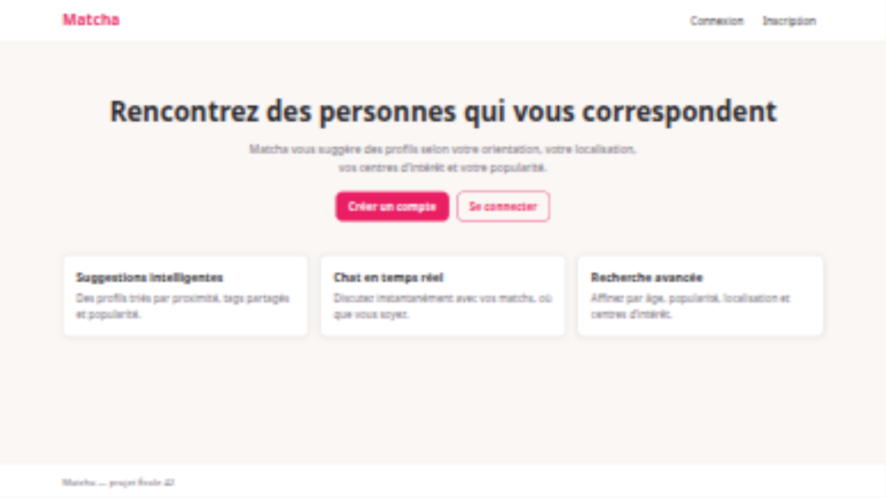
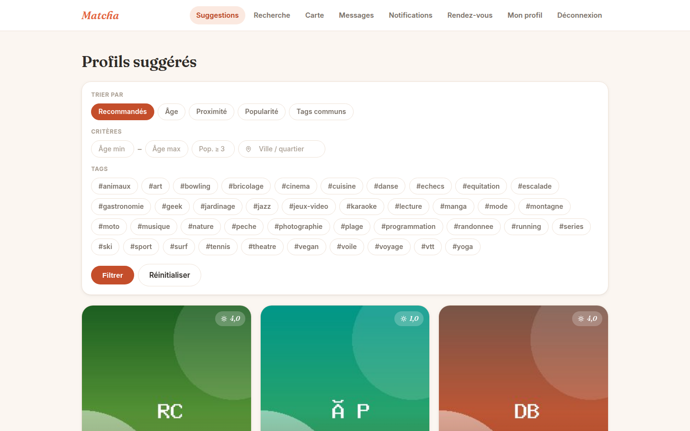
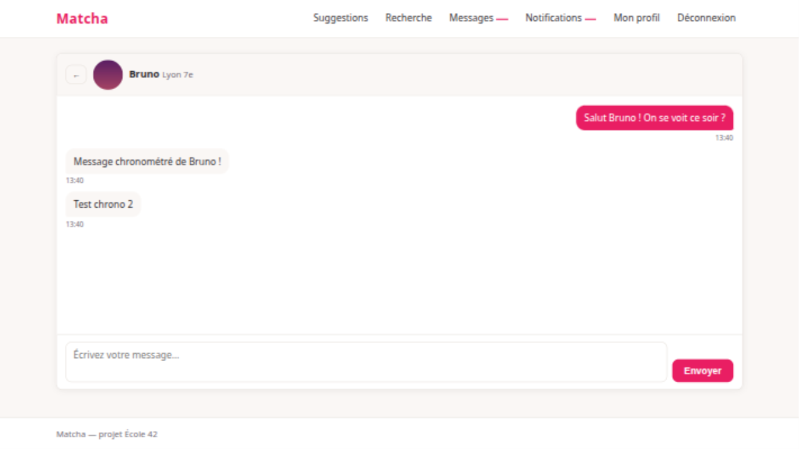
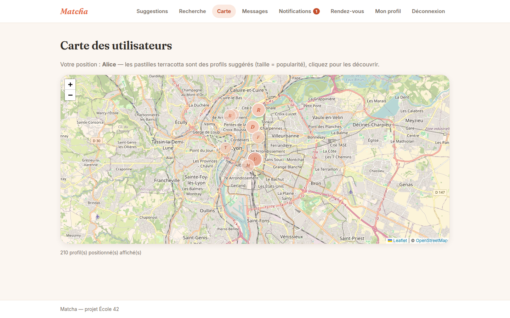

<div align="center">

# 💘 Matcha

**Site de rencontre complet** — profils, suggestions intelligentes, like/match, chat et notifications en temps réel.

<sub>Projet de fin d'études — École 42</sub>


</div>

---

## ✨ Fonctionnalités

| Domaine | Détails |
|---|---|
| **Authentification** | Inscription (email, username, nom, prénom), vérification par e-mail à lien unique, connexion, mot de passe oublié, déconnexion en un clic. Mots de passe anglais courants refusés (blacklist) + exigence de complexité |
| **Profils** | Genre, préférences sexuelles, biographie, tags réutilisables avec autocomplétion, jusqu'à 5 photos (une photo de profil), note de popularité publique, localisation GPS avec **consentement explicite** (RGPD) ou saisie manuelle |
| **Suggestions intelligentes** | Compatibilité d'orientation croisée (bisexuel par défaut), même zone géographique prioritaire, tags partagés, popularité — liste triable et filtrable (âge, localisation, popularité, tags) |
| **Recherche avancée** | Critères combinés : tranche d'âge, plage de popularité, localisation, un ou plusieurs tags |
| **Consultation de profil** | Toutes les infos sauf email/mot de passe, historique de visites, like (refusé côté serveur sans photo de profil), like mutuel = « connectés », unlike, blocage, signalement, statut en ligne |
| **Chat temps réel** | Réservé aux utilisateurs connectés, réception **≤ 10 s** (polling 5 s), badge global de nouveaux messages sur toutes les pages |
| **Notifications temps réel** | Les 5 événements (like, visite, message, like en retour, unlike), compteur global de non-lues |

## 🖼️ Aperçu

| | |
|---|---|
|  |  |
|  |  |

## 🛠️ Stack

- **Backend** : [Slim 4](https://www.slimframework.com/) (micro-framework : routeur + templating, sans ORM ni gestionnaire de comptes) — PHP 8.3
- **Templating** : Twig (échappement HTML automatique)
- **Base de données** : MySQL 8 via PDO — requêtes SQL écrites à la main (mini-lib `App\Db\Query`, prepared statements systématiques)
- **Architecture** : couche `Repository` (SQL centralisé) + `Entity`/`ViewModel` typés + services métier + contrôleurs fins
- **Temps réel** : polling AJAX 5 s (badges globaux + fil de chat)
- **Images** : extension GD, validation par magic bytes
- **E-mails** : client SMTP maison → MailHog en développement
- **Données de démo** : Faker (520 profils, photos générées en GD)
- **Déploiement** : Docker Compose (php-apache + MySQL + MailHog)

## 🚀 Démarrage rapide

```bash
# 1. Copier la configuration (jamais commitée)
cp .env.example .env

# 2. Lancer l'environnement
docker compose up -d --build

# 3. Appliquer le schéma de base de données
docker compose exec web php scripts/migrate.php

# 4. Générer 520 profils de démonstration
docker compose exec web php scripts/seed.php --force
```

- **Application** : <http://localhost:8090>
- **MailHog** (boîte mail de dev) : <http://localhost:8026>

> ⚠️ Après un `scripts/seed.php`, les fichiers d'images créés par le script appartiennent à `root` : relancez
> `docker compose exec web chown -R www-data:www-data public/assets/uploads`
> pour que l'édition GD (bonus galerie) puisse les réécrire.

## 🔑 Comptes de démonstration

Les 520 profils seed utilisent tous le mot de passe **`SeedPass123!`**
(username visible dans les suggestions, ex. `brun.etienne`).

Comptes de test dédiés au chat : `testeur_a` / `testeur_b` (mot de passe `Azerty123!`, déjà matchés entre eux).

## 📊 Note de popularité

> **Popularité = (likes reçus) + 2 × (matchs actifs) − (unlikes reçus)**

- Un **match** = like mutuel encore en vigueur ; un **unlike** est tracé et compte négativement.
- Note plafonnée entre **0 et 10**, recalculée à chaque like/unlike par `PopularityService`.
- Identique partout où elle est affichée ou triée (profil, suggestions, recherche, cartes).

## 🗂️ Structure du projet

```
public/            # Document root (bootstrap Slim, assets, uploads protégés)
src/
├── Controllers/   # Auth, Profile, Suggest, Search, User, Chat, Notification, Api, Map, Appointment
├── Middleware/    # Session, Csrf, Auth, ViewGlobals
├── Services/      # Matching, Popularity, Photo, Mail, Message, Notification
├── Repository/    # Accès aux données (SQL centralisé, prepared statements)
├── Entity/        # Entités readonly (User, Photo, Tag, Message, Token, Appointment)
├── ViewModel/     # Données typées pour les vues (ProfileCard, UserProfile, Conversation…)
├── Validation/    # Validators par domaine (Register, Profile, Location, Appointment)
├── Security/      # PasswordPolicy (blacklist + complexité)
└── Db/            # Query (mini-lib PDO maison) + ConnectionFactory
templates/         # Twig (layout responsive en-tête/main/pied)
database/          # Schéma MySQL (idempotent)
scripts/           # migrate.php, seed.php
docker/            # Dockerfile php-apache, php.ini, vhost
```

## 🏗️ Architecture

Ce projet adopte une **architecture en couches** (layered architecture) organisée selon le principe de séparation des préoccupations. Chaque couche a une responsabilité unique et communique uniquement avec la couche adjacent.

### Vue d'ensemble

```
┌─────────────────────────────────────────────────────┐
│  HTTP (Slim 4)                                      │
│  Routes → Controllers → Middleware PSR-15           │
├─────────────────────────────────────────────────────┤
│  Couche applicative                                 │
│  Services (logique métier) · Validators (règles)   │
├─────────────────────────────────────────────────────┤
│  Couche données                                     │
│  Repositories (SQL) · Db\Query (mini-lib PDO)      │
├─────────────────────────────────────────────────────┤
│  Couche présentation                                │
│  Twig templates ← ViewModels (données typées)      │
└─────────────────────────────────────────────────────┘
```

### Slim 4 comme micro-framework

Slim 4 fournit uniquement le **routeur** et l'**infrastructure HTTP** (PSR-7/PSR-15). Tout le reste — ORM, authentification, validation, templating — est either absent du framework ou intégré manuellement, ce qui impose une architecture propre :

- **Entrée unique** (`public/index.php`) : bootstrap du conteneur DI, empilement des middlewares, chargement des routes.
- **Routes déclaratives** (`routes.php`) : regroupées publique / privée (`AuthMiddleware`), résolution des contrôleurs par le conteneur DI.
- **Middlewares en oignon** : Session → CSRF → ViewGlobals → Routing → BodyParsing → Error.

### Inversion de dépendances (PHP-DI)

Le conteneur [php-di](https://php-di.org/) gère l'injection de dépendances par réflexion (autowiring) complétée par des définitions explicites pour les classes nécessitant de la configuration scalaire :

```php
// config/definitions.php — wiring explicite pour les services
MatchingService::class => static function (Container $c): MatchingService {
    return new MatchingService(
        $c->get(UserRepository::class),
        $c->get(TagRepository::class),
        $c->get(BlockRepository::class),
        $c->get('settings')
    );
},
```

Les contrôleurs, validators et repositories simples sont résolus automatiquement par autowiring. Les classes recevant des tableaux de config (services, controllers complexes) sont explicitement déclarées.

### Principes SOLID appliqués

| Principe | Application concrète |
|---|---|
| **S** — Single Responsibility | Chaque classe a **une seule raison de changer** : les contrôleurs gèrent le HTTP, les services la logique métier, les repositories le SQL, les DTOs la normalisation des entrées, les ViewModels la mise en forme des vues. |
| **O** — Open/Closed | L'architecture est ouverte à l'extension sans modification du code existant : un nouveau domaine (ex. Appointment) s'ajoute avec son controller + service + repository + DTO sans toucher aux modules existants. |
| **L** — Liskov Substitution | Les middlewares implémentent `Psr\Http\Server\MiddlewareInterface`, les contrôleurs implémentent la signature PSR-15 `__invoke(Request, Response, $args)` — intercompatibilité garantie par le contrat PSR. |
| **I** — Interface Segregation | Pas d'interfaces domaine surdimensionnées : chaque classe dépend uniquement des méthodes qu'elle utilise concrètement. Les contracts PSR (Request, Response, MiddlewareInterface) suffisent pour l'interopérabilité. |
| **D** — Dependency Inversion | Les contrôleurs dépendent des services et repositories, jamais de PDO directement. Les services dépendent des repositories (couche données abstraite). Le conteneur DI assemble le tout. |

### Patterns architecturaux

#### Contrôleurs fins (Thin Controllers)

Les contrôleurs sont des **adaptateurs HTTP** : ils extraient les données de la requête, déléguent au service/repository, et construisent la réponse (rendu Twig ou redirection). Aucune logique métier dans un controller.

```php
// AuthController —典型的ement mince
final class AuthController {
    public function __construct(
        private Twig $twig,
        private UserRepository $users,
        private AuthService $auth,
        private RegisterValidator $registerValidator,
    ) {}

    public function register(Request $request, Response $response): Response {
        $data = RegisterData::fromRequest((array) $request->getParsedBody());
        $errors = $this->registerValidator->validate($this->users, $data);
        if ($errors !== []) { /* render with errors */ }
        $result = $this->auth->register($data);
        /* flash + redirect */
    }
}
```

#### Repository Pattern

Chaque table de la base a un **repository dédié** qui encapsule toutes les requêtes SQL. Les requêtes sont préparées systématiquement (`prepared statements`). La mini-lib `Db\Query` fournit des helpers (`fetch`, `insert`, `update`) mais chaque repository écrit son propre SQL — pas de query builder abstrait.

#### Service Layer

Les services contiennent la **logique métier pure** — sans conscience du HTTP ni du SQL. Ils coordonnent plusieurs repositories et implémentent les règles de l'algorithme (suggestions, popularité, messagerie).

Exemple : `MatchingService` orchestre `UserRepository`, `TagRepository` et `BlockRepository` pour calculer le score de compatibilité (zone géographique, tags partagés, popularité) et appliquer la compatibilité d'orientation.

#### DTO (Data Transfer Objects)

Les DTOs `final readonly class` normalisent les données de formulaire via un constructeur statique `fromRequest(array $body)`. Ils isolent le controller du format brut de la requête et gèrent le trimming, le cast typé et le hachage des mots de passe.

```php
final readonly class RegisterData {
    public static function fromRequest(array $body): self { /* trim, cast */ }
    public function toRecord(): array { /* hash password, return row */ }
}
```

#### ViewModel Pattern

Les ViewModels (`ProfileCard`, `UserProfile`, `Conversation`…) façonnent les données **spécifiquement pour les vues**. Ils calculent les valeurs d'affichage (âge, temps relatif, formatage de popularité) pour que les templates Twig restent simples et sans logique.

#### Validation métier

Un validateur par domaine (`RegisterValidator`, `ProfileValidator`…) hérite d'un `Validator` fluide de base qui accumule les erreurs par champ. Les règles métier (unicité, plage d'âge, enums) sont centralisées dans les validateurs, pas dans les contrôleurs.

### Flux de données complet

```
Requête HTTP
  ↓
Middleware (Session, CSRF, Auth)
  ↓
Route → Controller (extraction via DTO)
  ↓
Validator (règles métier)
  ↓
Service (logique + coordination)
  ↓
Repository (SQL préparé)
  ↓
Db\Query → PDO → MySQL
  ↓
Entity / ViewModel (typage des résultats)
  ↓
Controller → Twig (rendu) → Réponse HTTP
```

### Pourquoi pas d'ORM ?

Le projet utilise des **requêtes SQL écrites à la main** plutôt qu'un ORM (Doctrine, Eloquent) pour trois raisons :

1. **Transparence** : chaque requête est visible, compréhensible et optimisable directement — pas de couche d'abstraction cachée.
2. **Contrôle total** : les Jointures complexes (suggestions avec score calculé, tags partagés, distance géographique) sont plus simples en SQL brut.
3. **Poids minimal** : Slim est un micro-framework ; y ajouter un ORM lourd contredit la philosophie du projet.

Le compromis est la mini-lib `Db\Query` qui factorise les opérations CRUD répétitives tout en gardant le SQL explicite.

## 🎁 Bonus

1. **Galerie photo** : téléchargement par glisser-déposer + édition d'image GD (rotation, filtres N&B/sépia/négatif/flou, recadrage)
2. **Carte interactive** : Leaflet + OpenStreetMap, marqueurs des profils suggérés positionnés
3. **Rendez-vous** : planification d'événements réels entre utilisateurs connectés

## 🔒 Sécurité

- Mots de passe **jamais en clair** (`password_hash` / bcrypt)
- **Anti-SQLi** : prepared statements sur 100 % des requêtes
- **Anti-XSS** : échappement Twig systématique
- **Anti-CSRF** : jeton en session exigé sur tout POST
- **Sessions** : `session_regenerate_id()` à la connexion, cookies `HttpOnly` + `SameSite=Lax`
- **Uploads** : magic bytes, renommage, dossier sans exécution de scripts
- `.env` local exclu de git

## 🧪 Tests

Checklist complète des scénarios de test (soutenance) : **[CHECKLIST.md](CHECKLIST.md)**.

## 📄 Licence

Projet pédagogique — École 42. Aucune licence d'utilisation publique.
